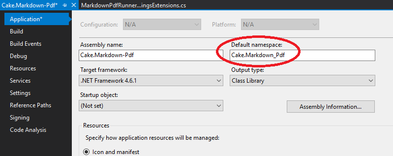
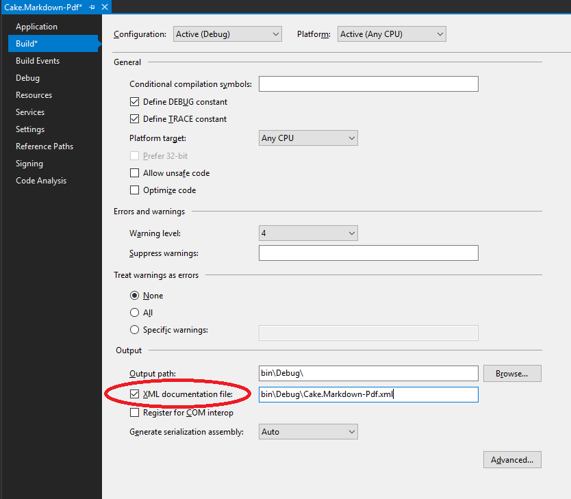

Title: Setting up the addin build process
Published: 26/8/2017
Tags:
- Cake
- Addin
- Build
- GitHub
- Recipe
- Cake.Recipe
- GitVersion
- AppVeyor
- Wyam
---
Now that we have our Cake addin written, it's time to put the finishing touches on and utilise the Cake teams preferred way of building addins - Cake.Recipe. I've written about [getting started with Cake.Recipe](./getting-started-with-cake-recipe.md), and there might be some crossover with that post, but most the content should be new.

We're going to make use of Cake.Recipe's tasks for documentation, versioning, as well as the normal aspects of building and running unit tests.

# Ready the repository

## Move the files

Cake.Recipe assumes a certain folder structure, and whilst it can be changed using the setup.cake file to alter various parameters, it's far easier if we stick with the convention.
In the root of the working copy, create a new folder called src. I suggest using git to move the files into this directory so you can maintain the history of each. We need to move both the project folders (Cake.Markdown-pdf and Cake.Markdown-pdf.Tests) as well as the solution file.
```bash
# Hint - Case sensitive for directories/files even in Windows
mkdir src
git mv Cake.Markdown-Pdf src
git mv Cake.Markdown-Pdf.Tests src
git mv Cake.Markdown-Pdf.sln src
```
I suggest you also move the packages folder from the root into the src folder, otherwise the first time you build it will recreate the packages folder and you'll have a duplicate that could cause confusion. It doesn't need tracking by git though.

## Create a nuspec file

Add another new folder called nuspec with a subdirectory of nuget
```bash
mkdir -p nuspec\nuget
```
Create a new text file in here called `Cake.Markdown_Pdf.nuspec`. The filename must be the same as the root namespace for the project or cake will not be able to locate the files for packaging.

Open it up and paste the following in, replacing as appropriate.
```xml
<?xml version="1.0"?>
<package >
  <metadata>
    <id>Cake.Markdown-Pdf</id>
    <title>Cake.Markdown-Pdf</title>
    <authors>Warren Bates</authors>
    <owners>Warren Bates</owners>
    <licenseUrl>https://github.com/wozzo/Cake.Markdown-Pdf/blob/master/LICENSE</licenseUrl>
    <projectUrl>https://github.com/wozzo/Cake.Markdown-Pdf</projectUrl>
    <iconUrl>https://cdn.rawgit.com/cake-contrib/graphics/a5cf0f881c390650144b2243ae551d5b9f836196/png/cake-contrib-medium.png</iconUrl>
    <requireLicenseAcceptance>false</requireLicenseAcceptance>
    <summary>Adds Markdown-Pdf alias for Cake</summary>
    <description>An alias for Cake to help with running Markdown-Pdf commands as part of a build</description>
    <tags>Cake Script Build Markdown Pdf Markdown-Pdf</tags>
  </metadata>
  <files>
    <file src="Cake.Markdown-Pdf.xml" target="lib\net45" />
    <file src="Cake.Markdown-Pdf.dll" target="lib\net45" />
  </files>
</package>
```

## GitVersion

Add a new `SolutionInfo.cs` file in the src folder and give it the following content
```xml
using System.Reflection;

[assembly: AssemblyVersion("0.1.0")]
[assembly: AssemblyFileVersion("0.1.0")]
[assembly: AssemblyInformationalVersion("0.1.0")]
```

This is going to be a shared file that will get updated with version information as part of the cake build. The following steps need to be repeated for each project in the solution.

1. Open up the `properties\AssesmblyInfo.cs` file and remove the three properties we've just added to the `SolutionInfo.cs` file.
2. Open up the csproj file, find the reference to the `AssemblyInfo.cs` file, and add the following after
```xml
<Compile Include="..\SolutionInfo.cs">
  <Link>Properties\SolutionInfo.cs</Link>
</Compile>
```

## XML Documentation

Open up the solution in Visual Studio and open the Cake.Markdown-Pdf project properties. On the Build page select the 'XML Documentation file' checkbox. Do this for each build configuration.



This will mean you'll need to add in xml comments or the build will fail. Building in Visual Studio should show warnings were they are missing

# Get Cake.Recipe

Head to the [Cake.Recipe repository](https://github.com/cake-contrib/Cake.Recipe) on GitHub and download the following list of files into the root of our repository.
- .appveyor.yml
- .gitignore
- GitReleaseManager.yaml
- build.ps1
- config.wyam
- setup.cake

Open up `setup.cake` in a text editor and change the title, repositoryOwner, repositoryName, and appVeyorAccountName settings as appropriate. I've also added the nuspecFilePath from earlier.

```csharp
BuildParameters.SetParameters(context: Context,
                            buildSystem: BuildSystem,
                            sourceDirectoryPath: "./src",
                            title: "Cake.Markdown-Pdf",
                            repositoryOwner: "wozzo",
                            repositoryName: "Cake.Markdown-Pdf",
                            appVeyorAccountName: "wozzo",
                            nuspecFilePath: "nuspec/nuget/Cake.Markdown-Pdf.nuspec");
```

Ensure the last line calls the `Run()` method.

You should now be able to run the build from the command line
```powershell
.\build.ps1
```

# Documentation

Cake.Recipe uses [Wyam](https://wyam.io) to auto generate a static site and commit it to the gh-pages branch of the project on GitHub. For those that don't know this is a special branch that GitHub uses to serve up site content at the url https://<username>.github.io/<reponame>. For example this project's documentation will be at https://wozzo.github.io/Cake.Markdown-Pdf.

Add a new folder called `docs` in the root of the repo. Get wyam installed and run the following from that directory.

```
wyam new -r docs
```

You can then delete the wyam.config file it creates in that directory. 

You can now start editing the markdown pages to change the content of the site. I won't go into detail of using wyam as there are plenty of other blogs on that that go outside the scope of this tutorial.

You can preview the site by running this command and then visisting http://localhost:5080/Cake.Markdown-Pdf (case sensitive)

```powershell
.\build.ps1 -target preview
```

# AppVeyor

To use AppVeyor and cake together you'll need to setup several environment variables for your project. This lies outside of the scope of this tutorial but you can figure most of it out by reading through the appveyor.cake/environment.cake files in Cake.Recipe.

The only additional change I needed to do to get the build working was to add an `Image:` property specifying which [build worker image](https://www.appveyor.com/docs/build-environment/#build-worker-images) AppVeyor should use. Because I used Visual Studio 2017 I needed to add the following to my `.appveyor.yml` file.

```yaml
image: Visual Studio 2017
```

# Finishing up

Commit the files and push to GitHub. The build should take care of the rest. You should definitely consider getting your project added to the Cake-Contrib team on GitHub. See [the cake-contrib](https://github.com/cake-contrib/Home) page for more details.