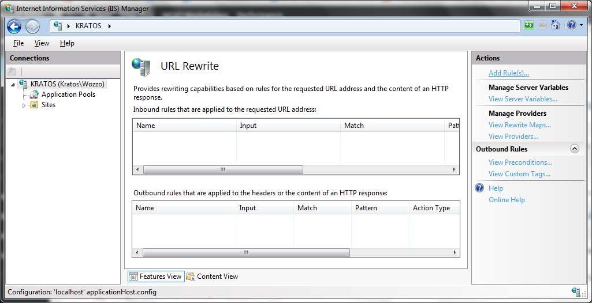
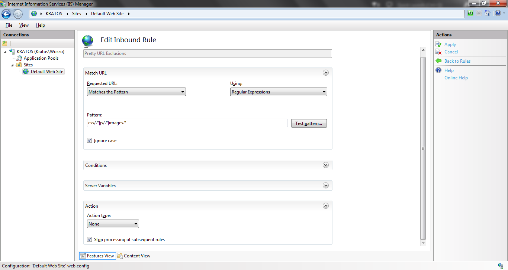

Title: Configuring for Pretty URLs in AngularJS and Visual Studio
Published: 8/6/2015
Tags:
- CSharp
- C#
- Visual Studio
- AngularJS
- JavaScript
RedirectFrom: configuring-for-pretty-urls-in-angularjs-and-visual-studio
---
Pretty URLs look much better than some of the long query string type URLs we've gotten used to.
AngularJS makes it very simple to use pretty urls just follow the steps below and then configure for your server.

You need to include the ngRoute module with the following line:

```html
<script src="//ajax.googleapis.com/ajax/libs/angularjs/1.2.25/angular-route.js"></script>
```

Our SPA also needs to know where to put the templates when a sub page is requested. Create a div in your page and add the ng-view attribute. That's it.

```html
<div ng-view>
    <!-- Content will be injected here -->
</div>
```

Next you need to add `$routeProvider` and `$locationProvider` to your config and set them up.
You use the when() function to define which view to serve up depending on what the path is. For example:

```javascript
mainApp.config(function ($routeProvider, $locationProvider) {
    // Route for home page
    $routeProvider.when('/', {
        templateUrl: '_home/home.html',
        controller: 'CarouselCtrl'
    })
    .when('/about', {
        templateUrl: '_about/about.html',
        controller: 'aboutCtrl'
    })
    .otherwise({
        redirectTo: "/"
    });
 
    $locationProvider.html5Mode(true);
});
```

This means that if I go to http://yourserver.com/about the page will serve up the contents of the _about/about.html.
The $locationProvider line is required if you would like to also remove the hash from the URL. Without this your urls will appear like http://yourserver.com/#/about; If you aren't worried about the # then you're finished and the following steps will not be necessary. Older browsers will also default back to using the # if they aren't fancy enough for pretty URLs.

Configuring your webserver to always route back to the index.html file, or whatever you main app's file is, is probably the trickiest aspect of this process. You also need to exclude any folders which actually do exist because otherwise the webserver will route back to index.html when trying to find each of your site assets (css files, images, etc.).

# For IIS Express:

(See below for IIS Web Core as used in VS)

1. Download [URL Rewrite](http://www.iis.net/downloads/microsoft/url-rewrite)
2. Run IIS Manager (found in the start menu)
3. Expand the panel on the left to find your site
4. Load URL Rewrite



5. Click "Add Rule"
6. Choose a blank inbound rule
8 Call it Pretty URL Exclusions. These will be the folders that actually exist that you don't want to be rerouted.
7. Select "does not match the pattern"
8. Add in a regular expression to ignore all the folders that exists
   
   For example:
To ignore the common folder and its contents use `common/.*`
Then use the pipe (|) to separate it from another folder
You might end up with something like
`css/.*|js/.*|images.*`
9. For these folders we want the action type to be "None"
10. Check "Stop processing of subsequent rules
11. Apply the rule



12. Create another blank inbound rule
13. Call it Pretty URL Redirect.
14. Select Matches the pattern and input .* to match all paths
15. Choose Redirect as the action type
16. Set the url to index.html or your main app file.
17. Apply the rule and restart the webserver.

# For IIS Web Core (Visual Studio)

I found the easiest thing to do here was just add the same rules as above directly into the web.config file in the project.
Open it up and add in the following (edited for your folders ofcourse: see IIS Express above for more details) between your configuration tags.

```xml
<system.webServer>
    <rewrite>
        <rules>
            <clear />
            <rule name="Pretty URL Exclusions" stopProcessing="true">
                <match url="(css/.*|js/.*|images/.*)" />
                <conditions logicalGrouping="MatchAll" trackAllCaptures="false" />
                <action type="None" />
            </rule>
            <rule name="Pretty URL Redirect">
                <match url="(.*)" />
                <conditions logicalGrouping="MatchAll" trackAllCaptures="false" />
                <action type="Rewrite" url="index.html" />          
            </rule>
        </rules>
    </rewrite>
</system.webServer>
```
Restart your server and it should take effect straight away.

# Apache Web Server

Apache is configured using the .htaccess file. It's typically located in the wwwroot folder. Find and open it in your editor of choice. Assuming the mod_rewrite.c is installed add the following lines to the .htaccess file to check if a file exists and if not redirect to the base file as above.

```xml
<ifModule mod_rewrite.c>
    RewriteEngine On
    RewriteCond %{REQUEST_FILENAME} !-f
    RewriteCond %{REQUEST_FILENAME} !-d
    RewriteCond %{REQUEST_URI} !index
    RewriteRule (.*) index.html [L]
</ifModule>
```

Note: If you're doing this on a unix based system it's likely case sensitive so you will need to be very careful that you have typed all of your src tags in correctly. Or you could add the following as well and install the mod_speling.c if necessary.

```xml
<IfModule mod_speling.c>
    CheckSpelling On
    CheckCaseOnly On
</IfModule>
```

Restart your server and you should be good to go.

# Hints:
1. Add `caseInsensitiveMatch: true` to the when functions to remove case sensitivity.
2. Check that all of your assets are linked correctly from your index.html file.
  For example `<link href="Content/nav.css" rel="stylesheet" />` will not work if you attempted to access one of the "subfolders" because the browser would be looking in that subfolder for the content folder and nav file.
  Add a / to the front of the path to solve this problem (took me 20 minutes to figure that one out).
`<link href="/Content/nav.css" rel="stylesheet" />` will work