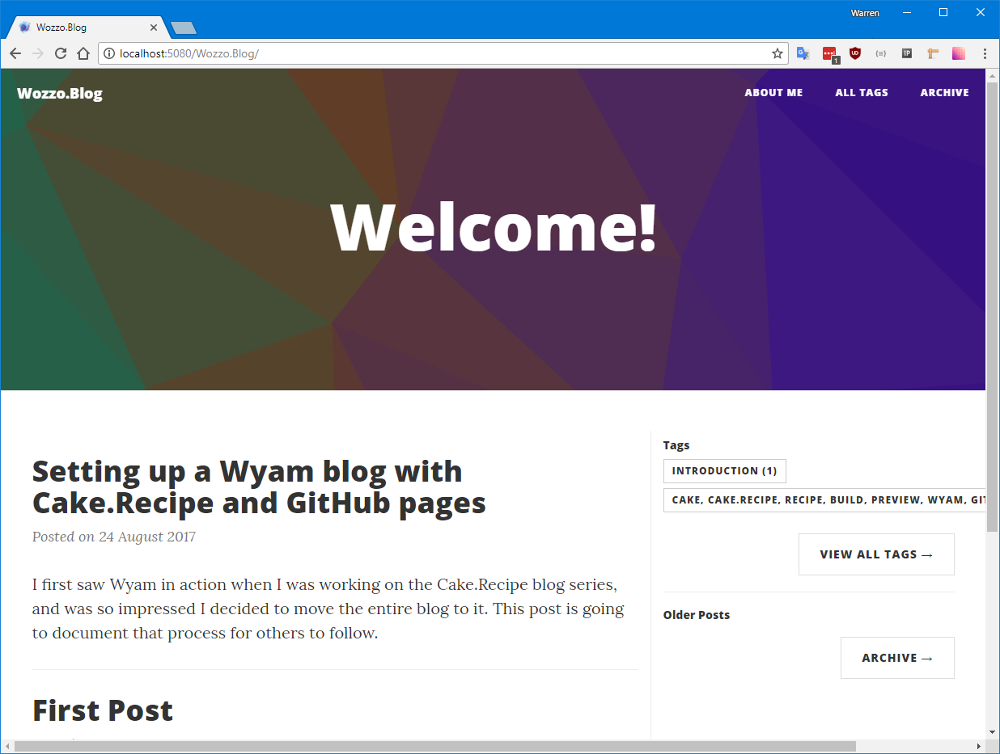
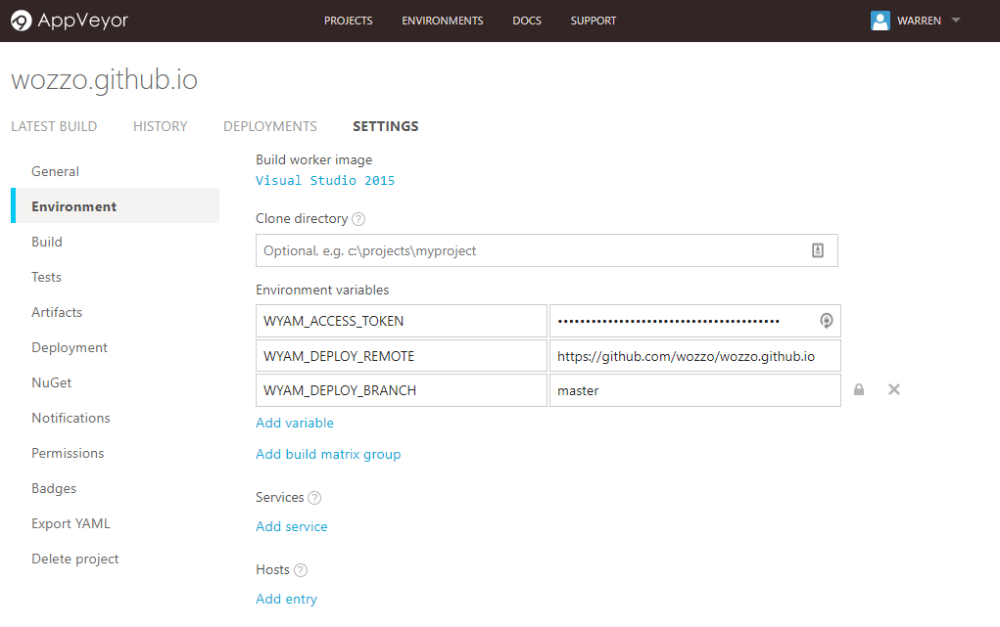

Title: Setting up a Wyam blog with Cake.Recipe and GitHub pages
Published: 24/8/2017
Tags: Cake, Cake.Recipe, Recipe, Build, Preview, Wyam, GitHub, Pages, Blog
---
I first saw [Wyam](https://wyam.io) in action when I was working on the Cake.Recipe blog series, and was so impressed I decided to move the entire blog to it using GitHub pages to serve it up.
This post is going to document that process for others to follow.
One important distinction to get out of the way is the difference between a personal github page and a project page. 

Personal page url's take the form `https://<username>.github.io/` while project pages take the form `https://<username>.github.io/<project_name>`. Project pages can be served from any branch in the repository but personal pages can only be served from the master branch. Because of this there will be some slightly different instructions/hacks depending on whether you intend to use this process to create a personal or project page.

# Setting up the repositories

## Personal pages
Create a repository which matches the pattern `<username>.github.io`, e.g. mine is [wozzo.github.io](https://github.com/wozzo/wozzo.github.io). For personal pages the `master` branch must be the one that contains the output from the Wyam build. Make a single commit to the `master` branch of this empty repository.

Use the following commands to create a new orphaned branch called `develop`. It must be called `develop` for cake.recipe to publish the documentation using AppVeyor (remember I mentioned some hacks?).
```
git checkout --orphan develop
```
Do an initial commit on this branch too. The majority of our work will be in this `develop` branch, while we leave the `master` branch to AppVeyor. Use the branch name `develop` elsewhere in this tutorial where I use the term "working branch"

## Project pages
If a branch exists called `gh-pages` then GitHub will use this branch to serve your sites content.
Create a new orphaned branch with the following command
```
git checkout --orphan gh-pages
```
Do an initial commit on this branch and then switch back to the master branch. Use the branch name `master` elsewhere in this tutorial where I use the term "working branch".

# Starting with Wyam

Not strictly a required step, but it might make life easier. Install wyam on your machine - to see how to get Wyam go to their [obtaining](https://wyam.io/docs/usage/obtaining) page.
Note: I had to add %appdata%/local/wyam to my path to allow powershell to be able to run wyam commands.

# Creating your blog

Wyam uses recipes to setup the outline of your site quickly. Create a folder called "docs" in the root of your working branch. In your command line interface of choice browse to the docs folder and run the following command
```
wyam new --recipe blog
```
This will create a new folder called input and setup a couple of pages under there. Follow the next few steps to see what this blog will look like, then we'll start adding some content. The recipe will also add a config.wyam file, but we won't be needing this. It is safe to delete.

# Getting Cake.Recipe

Go to [Cake.Recipe](https://github.com/cake-contrib/Cake.Recipe) on GitHub and download the following files to the root of your working branch.

* .appveyor.yml
* .gitignore
* build.ps1
* config.wyam
* GitReleaseManager.yaml
* setup.cake


## Setup Cake.Recipe
Open up the `setup.cake` file in your favourite text editor and edit the parameters so that it reflects the name of your blog.

```csharp
BuildParameters.SetParameters(context: Context,
                            buildSystem: BuildSystem,
                            title: "Wozzo.Blog",
                            repositoryOwner: "wozzo",
                            repositoryName: "wozzo.github.io",
                            appVeyorAccountName: "wozzo",
                            wyamRecipe: "Blog",
                            wyamTheme: "CleanBlog");
```
If you're working on a personal page then you may also want to provide an additional parameter to change the virtual directory the website is compiled for. By default Cake will use the `repositoryName` value.
For a personal site you add the following parameter.
```
webLinkRoot: "/"
```

I've also added two additional parameters telling Wyam that it should use the blog recipe and Phantom theme.

## Setup AppVeyor's config

We won't setup AppVeyor just yet, but we can start to get things in place with the `.appveyor.yml` config file. Open it up and change the target of the build to `Force-Publish-Documentation`.
```
#---------------------------------#
#  Build Script                   #
#---------------------------------#
build_script:
  - ps: .\build.ps1 -Target Force-Publish-Documentation
```

If you're working on a personal page you should also remove `master` from the branch whitelist

```
#---------------------------------#
#        Branches to build        #
#---------------------------------#
branches:
  # Whitelist
  only:
    - develop
    - /release/.*/
    - /hotfix/.*/
```

At this point you should make another commit. If you don't have any commits GitVersion will throw an exception when attempting to run the cake build.

# Previewing the site locally

Time to see what it looks like. The cake.recipe Wyam script comes with a Preview task which will fire up a local web server, and run wyam with a watch on your files. This means you can view the site in your browser, edit your posts and the browser will refressh so you can see your changes immediately.

Run the following command in the root of your repository.

```
.\build.ps1 -target preview
```

The first run may take a while as it is going to get all the tools it requires, future runs should be much faster.
Look at the end of the build log and you should find a message like the following

```
Preview server listening on port 5080 and serving from path file:///.../wozzo
.blog/BuildArtifacts/Documentation with virtual directory Wozzo.Blog and LiveReload support
Watching paths(s) file:///.../content, theme, input
Watching configuration file file:///.../wozzo.blog/config.wyam
Hit any key to exit
```

The key parts are the port and virtual directory. For personal sites there will be no virtual directory. Replace them in the following url in your browser.

```
http://localhost:<port>/<virtual_directory>/

# Example
http://localhost:5080/Wozzo.Blog
```
The virtual directory is case sensitive by the way ;-)



Isn't it pretty. For some reason when I tried to use the SolidState theme I got exceptions due to missing files. If you get it working, please get in touch.

# AppVeyor

Wyam's site has some really great [instructions for setting up Wyam with AppVeyor](https://wyam.io/docs/deployment/appveyor), and it's worth looking through but we're going to do things differently to get the benefits of working with Cake.Recipe.

Cake.Recipe has everything setup with either parameters, or Environment variables. The credentials and settings for most of what we'll need is done through environment variables.
Log in to AppVeyor and add a new project, select your repository. If doing a personal site then change the default branch to `develop` on the project settings page.
Go to the project settings page and find the Environment section. We'll need to add three variables here for Cake.Recipe to be able to deploy our site.
```
# Url of the git repository
WYAM_DEPLOY_REMOTE   =   https://github.com/wozzo/wozzo.github.io
# Branch to deploy the site too
WYAM_DEPLOY_BRANCH   =   master / gh-pages
# GitHub personal access token
WYAM_ACCESS_TOKEN    =   **************************************
```
The access token must be kept secret. You can create one by following these [instructions](https://help.github.com/articles/creating-a-personal-access-token-for-the-command-line/). 



# Get Blogging

That's all the setup complete. Now commit any uncommitted changes and push your working branch to the remote. AppVeyor should pick it up and run it deploying your site.

If there are any problems check the AppVeyor build log. In particular the `Printing Build Parameters...` section can provide useful insight.
